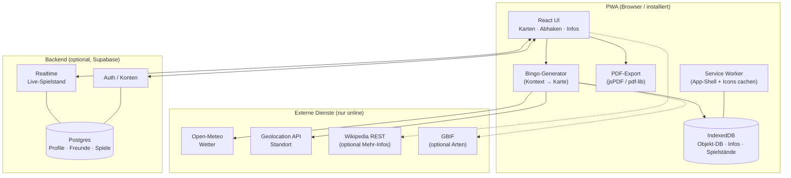

# 🌲 Waldbingo – Konzept & Architektur

**Version:** 1.0 · **Datum:** 16. Juni 2026 · **Autor:** Konzept für Konrad Thiemann

Dieses Dokument beschreibt den Ausbau des heutigen Waldbingo‑PDF‑Generators zu einer
**offline‑fähigen Progressive Web App (PWA)** mit dynamischen, kontextabhängigen
Bingokarten, Nutzerkonten, Multiplayer und einer Druckansicht für bis zu 10 Spieler.
Es ist als Entscheidungs‑ und Planungsgrundlage gedacht – Code entsteht erst danach.

---

## 1. Ist‑Zustand

Das bestehende Projekt ist ein eigenständiges Python‑Skript:

- `waldbingo.py` – erzeugt mit **reportlab** ein DIN‑A4‑PDF mit 4 festen 5×5‑Karten.
- `icons.py` – 25 handgezeichnete, rein vektorielle Strichicons (Canvas‑Primitive).
- 25 feste Begriffe, zufällig pro Karte gemischt, optionaler Seed.

**Stärken, die wir mitnehmen:** die Vektor‑Icons (verlustfrei, kindgerecht, offline),
die durchdachte Layout‑Logik und die Farbwelt. **Grenzen:** statische Begriffsliste,
keine App, keine Personalisierung, kein Bezug zu Ort/Zeit/Wetter, fest auf 4 Karten.

Die größte Architektur‑Entscheidung ist deshalb: Die heutige Logik wird nicht
weggeworfen, sondern in zwei Welten überführt – eine **Web‑/App‑Darstellung** und einen
**PDF‑Export** – die sich **dieselben Daten und dieselben Piktogramme** teilen.

---

## 2. Vision & Leitprinzipien

Waldbingo wird ein digitaler Begleiter für Familien‑ und Gruppenausflüge in die Natur.
Beim Start (oder beim Drucken) erzeugt die App eine Bingokarte, deren Felder zur
**aktuellen Situation** passen: Was findet man hier, jetzt, bei diesem Wetter, zu dieser
Jahreszeit? Kinder suchen die Dinge, haken sie ab und können zu jedem Fund eine kurze,
kindgerechte Info aufrufen.

Vier Leitprinzipien ziehen sich durch alle Entscheidungen:

1. **Offline zuerst.** Im Wald gibt es selten Netz. Die App muss vollständig ohne
   Internet funktionieren – Kartenerstellung, Abhaken, Infotexte und Druck inklusive.
2. **Eine Quelle der Wahrheit.** App‑Ansicht und Druck‑PDF entstehen aus demselben
   Datenmodell und denselben Icons. Kein Inhalt wird doppelt gepflegt.
3. **Kindgerecht & sicher.** Große Piktogramme, einfache Sprache, und besonders strenger
   Umgang mit Standort‑ und personenbezogenen Daten von Kindern (siehe §11).
4. **Kuratiert statt zufällig.** Inhalte stammen aus einer geprüften Datenbank mit
   Regeln – nicht aus unvorhersehbaren Live‑Generierungen.

---

## 3. Plattform‑Entscheidung: PWA

Gewählt ist eine **Progressive Web App**. Begründung gegenüber den Alternativen:

| Kriterium | PWA (gewählt) | Native (iOS+Android) |
|---|---|---|
| Eine Codebasis | ✅ ja | ❌ zwei (oder Cross‑Framework) |
| Offline‑fähig | ✅ Service Worker + IndexedDB | ✅ |
| Installierbar aufs Handy | ✅ „Zum Startbildschirm" | ✅ App Store |
| GPS / Standort | ✅ Geolocation API | ✅ (etwas genauer) |
| PDF erzeugen & drucken | ✅ direkt im Browser | ⚠️ aufwändiger |
| Kosten / Wartung | gering | hoch (Store‑Gebühren, Reviews) |
| Verteilung | URL teilen, sofort nutzbar | App‑Store‑Freigabe nötig |

Für Waldbingo zählt vor allem: **Druck + App aus einer Codebasis**, kostenlose
Verteilung und voller Offline‑Betrieb. Eine PWA deckt alle genannten Anforderungen ab.
Sollte später echte Hintergrund‑Standortverfolgung oder tiefe Geräteintegration nötig
werden, lässt sich die PWA mit Capacitor in eine native Hülle packen, ohne den Kern neu
zu schreiben.

---

## 4. Tech‑Stack (Empfehlung)

**Frontend:** React + Vite + TypeScript. PWA‑Funktionen über **Vite PWA Plugin**
(Workbox) für Service Worker und Caching. UI mit Tailwind CSS. Für die App‑Darstellung
der Karten und Icons setzen wir auf **SVG** – die bestehenden reportlab‑Icons werden
einmalig nach SVG portiert und sind dann in App und PDF identisch nutzbar.

**Lokale Daten / Offline:** **IndexedDB** (über eine schlanke Bibliothek wie Dexie.js)
für die kuratierte Objekt‑Datenbank, Infotexte, gespeicherte Spiele und Spielstände.
Der Service Worker cached die App‑Shell und alle Piktogramme (cache‑first), API‑Daten
wie Wetter werden network‑first mit Fallback geladen.

**PDF im Browser:** **pdf‑lib** oder **jsPDF**. Da die heutige Layout‑Logik
koordinatenbasiert ist, passt **jsPDF** (zeichnet per X/Y wie ein Canvas) am direktesten
zum bestehenden Ansatz; **pdf‑lib** ist die modernere, flexiblere Alternative, falls wir
später Formularfelder o. Ä. brauchen. Beide laufen vollständig clientseitig, also auch
offline.

**Backend (nur für Multiplayer/Konten):** **Supabase** – liefert Auth, Postgres‑Datenbank
und Realtime in einem. Der kostenlose Tarif (50.000 monatlich aktive Nutzer für Auth,
200 gleichzeitige Realtime‑Verbindungen, 2 Mio. Realtime‑Nachrichten/Monat) reicht für
Start und MVP locker. Wichtig: Das Backend ist **optional** – Einzelspiel und Druck
funktionieren ganz ohne Konto und ohne Netz.

---

## 5. Datenmodell: die kuratierte Objekt‑Datenbank

Herzstück ist eine geprüfte Liste von „Wald‑Objekten". Jedes Objekt trägt Metadaten
(Tags), nach denen die Bingo‑Generierung filtert. Beispielstruktur eines Eintrags:

```json
{
  "id": "eichhoernchen",
  "name": "Eichhörnchen",
  "kategorie": "Tier",
  "icon": "eichhoernchen.svg",
  "jahreszeiten": ["fruehling", "sommer", "herbst", "winter"],
  "wetter": ["klar", "bewoelkt"],
  "tageszeit": ["morgen", "tag"],
  "habitat": ["laubwald", "mischwald", "park"],
  "regionen": ["DE-weit"],
  "schwierigkeit": 2,
  "info": {
    "kurz": "Ein flinkes Nagetier mit buschigem Schwanz, das in Bäumen klettert.",
    "erkennen": "Rotbraunes oder schwarzes Fell, springt von Ast zu Ast.",
    "wusstest_du": "Es vergräbt Nüsse als Vorrat – und vergisst manche, daraus wachsen Bäume!"
  }
}
```

Jedes Objekt ist damit nach **Jahreszeit, Wetter, Tageszeit, Habitat, Region,
Schwierigkeit/Alter** filterbar. Die Infotexte sind direkt eingebettet, damit das
„Mehr‑Infos"-Feature auch **offline** funktioniert (siehe §8). Die Datenbank wird mit der
App ausgeliefert und beim ersten Start in IndexedDB gespeichert; Updates kommen als
versioniertes Daten‑Paket nach.

**Pflegeumfang Start:** Aus den heutigen 25 Begriffen auf ca. **80–120 Objekte**
erweitern, damit für jede Kontext‑Kombination genügend Auswahl bleibt (ein 5×5‑Bingo
braucht 25 Felder; bei mehreren Spielern und gefiltertem Pool empfiehlt sich ein Vielfaches).

---

## 6. Dynamische Bingo‑Generierung

Der Kern‑Algorithmus erzeugt aus dem aktuellen **Kontext** eine Karte:

**Schritt 1 – Kontext bestimmen.** Sammle die Eingangswerte:
Standort → Region/Habitat, aktuelles Datum → Jahreszeit, Wetter‑API → Wetterlage,
Uhrzeit → Tageszeit, optional Alter/Schwierigkeit des Spielers.

**Schritt 2 – Pool filtern.** Aus der Datenbank alle Objekte wählen, deren Tags zum
Kontext passen (z. B. Jahreszeit = Herbst UND Wetter passt UND Habitat passt).

**Schritt 3 – Gewichten.** Jedem Objekt einen Score geben, damit besonders gut passende
und typische Funde wahrscheinlicher werden (z. B. nach Regen Schnecken/Pilze hochgewichten,
bei Sonne Schmetterlinge/Eidechsen). So fühlt sich die Karte „echt" an, ohne starr zu sein.

**Schritt 4 – Mischung garantieren.** Sicherstellen, dass eine ausgewogene Mischung aus
Kategorien (Tiere, Pflanzen, Spuren, Landschaft) entsteht – nicht 25× Pflanzen.

**Schritt 5 – Auswählen & anordnen.** 25 Objekte ziehen (mit Seed reproduzierbar) und ins
5×5‑Raster setzen. Bei Mehrspieler bekommt jeder dieselben Objekte in anderer Anordnung
(klassisches Bingo) – aus dem **gleichen** kontextbezogenen Pool.

### Welche Werte sind relevant? (Antwort auf deine Frage)

Über die drei genannten (Ort, Jahreszeit, Wetter) hinaus lohnen sich:

- **Tageszeit / Dämmerung** – Eulen, Fledermäuse, Glühwürmchen am Abend; Vogelgesang am Morgen.
- **Habitat / Biotop‑Typ** – Laub‑, Nadel‑, Mischwald, Gewässer/Teich, Lichtung, Feldrand,
  Park. Lässt sich grob aus Standort + OpenStreetMap‑Landnutzung ableiten oder offline im
  Ortpicker manuell wählen. Sehr wirkungsvoll, weil es die Funde stark prägt.
- **Wetter‑Detail statt nur „Wetter"** – Regen vorher → Schnecken, Pilze, Pfützen, Regenwürmer;
  Sonne/Wärme → Insekten, Eidechsen; Wind → ziehende Wolken, raschelndes Laub; Frost/Schnee
  → Spuren im Schnee, Eiszapfen, Raureif.
- **Temperatur** – steuert Insekten‑ und Reptilienaktivität.
- **Region / Geografie & Höhenlage** – Alpenraum vs. Tiefland, Küste vs. Binnenland.
- **Schwierigkeitsgrad / Alter** – einfache, häufige Funde für Kleine; seltenere/„Experten"-
  Felder für Größere. Auch als Spielmodus nutzbar.
- **Mondphase / klarer Himmel** – optionaler „Nacht‑/Sternenmodus".

Empfehlung: Mit **Ort, Jahreszeit, Wetter, Tageszeit, Habitat** starten (deckt 90 % des
Mehrwerts ab), die übrigen Werte als spätere Feinjustierung.

---

## 7. Datenquellen (recherchiert)

**Wetter – [Open‑Meteo](https://open-meteo.com/).** Kostenlos, **kein API‑Key**, keine
Anmeldung, bis 10.000 Aufrufe/Tag frei für nicht‑kommerzielle Nutzung. Liefert aktuelles
Wetter, Vorhersage und historische Werte als JSON über simple HTTP‑GET‑Aufrufe, gespeist
u. a. aus DWD‑ICON. Ideal für eine PWA. Wir holen das Wetter beim Kartenerstellen einmal
online und cachen es; offline nutzt die App das zuletzt bekannte Wetter oder lässt es den
Nutzer wählen.

**Standort – Browser‑[Geolocation API](https://developer.mozilla.org/docs/Web/API/Geolocation_API).**
Liefert Koordinaten mit Nutzererlaubnis. Für „Ort → Region/Habitat" reicht eine grobe
Auflösung. **Offline‑Ortpicker:** Da im Wald Netz und teils GPS fehlen können, bekommt der
Nutzer immer die Möglichkeit, Region/Habitat manuell aus einer Liste zu wählen
(z. B. „Mischwald, Norddeutschland"). Reverse‑Geocoding (Koordinate → Ortsname) nur online,
mit manuellem Fallback.

**Infotexte – primär eingebettet, optional angereichert.** Die kurzen, kindgerechten Texte
liegen in der kuratierten DB (offline). Optional **online** anreichern über die
[Wikipedia/Wikimedia REST API](https://www.mediawiki.org/wiki/API:REST_API/Reference)
(`/page/summary/<Artikel>` liefert eine fertige Zusammenfassung) – aber nur als „mehr lesen",
nie als Pflichtinhalt, da Wikipedia‑Texte nicht kindgerecht sind und Netz brauchen.

**Regionale Artenvorkommen – optional, [GBIF](https://techdocs.gbif.org/en/openapi/).**
Freie, key‑lose API mit 2,5 Mrd. Artvorkommen, abfragbar nach Standort. Kann später genutzt
werden, um die kuratierte Liste regional zu plausibilisieren oder einen „Was kommt hier
wirklich vor?"-Modus zu bauen. Für den Start nicht nötig, da kuratiert.

---

## 8. Offline‑Konzept

Offline‑Fähigkeit ist kein Zusatz, sondern Grundannahme. Drei Schichten greifen ineinander:

- **Service Worker (Workbox):** cached die App‑Shell (HTML/JS/CSS) und **alle Piktogramme**
  cache‑first, sodass die App ohne Netz startet. Wetter‑ und sonstige API‑Aufrufe laufen
  network‑first mit Cache‑Fallback.
- **IndexedDB (Dexie):** speichert die komplette kuratierte Objekt‑Datenbank inkl.
  Infotexte, dazu gespeicherte/aktive Spiele und Abhak‑Status. So funktionieren
  Kartenerstellung, „Mehr Infos" und Spielstand vollständig offline.
- **Background Sync:** Multiplayer‑Aktionen (Felder abhaken, Spiel beitreten), die offline
  passieren, werden in eine Warteschlange gelegt und automatisch synchronisiert, sobald
  wieder Netz da ist.

Praktischer Ablauf: Zuhause mit WLAN das Spiel erstellen (Wetter/Standort werden geladen),
dann offline in den Wald – Suchen, Abhaken, Infos lesen, alles lokal; beim nächsten
Netzkontakt synchronisiert sich der Mehrspieler‑Stand.

---

## 9. Multiplayer & Nutzerkonten

**Konten/Anmeldung** über Supabase Auth (E‑Mail/Passwort oder Magic‑Link; ggf. später
Social‑Login). Wichtig: Konto ist **freiwillig** – Einzelspiel und Druck gehen ohne.

**Freundesliste.** Nutzer können andere per Nutzername/Code suchen und eine
Freundschaftsanfrage senden. Tabellen (vereinfacht): `profiles`, `friendships`
(Status anfrage/akzeptiert), `games`, `game_players`, `game_cells` (Abhak‑Status pro
Spieler und Feld).

**„Zusammen spielen".** Ein Spieler erstellt ein Spiel (legt Kontext/Karte fest) und lädt
Freunde ein bzw. teilt einen **Spiel‑Code/Link**. Alle Mitspieler bekommen denselben
kontextbezogenen Objekt‑Pool, die Anordnung pro Karte unterscheidet sich. Über Supabase
**Realtime** sehen alle live, wer was gefunden hat, und wer zuerst „Bingo" ruft. Gewinnregeln
(Reihe, Vollbild, 4 Ecken, T‑Form, kooperativ) werden beim Erstellen gewählt – die heutige
README‑Logik wird hier übernommen.

**Spielmodi:** kompetitiv (jeder eigene Karte) oder kooperativ (gemeinsam alle Felder
finden – schön für Familien mit kleinen Kindern).

---

## 10. Druck‑ & PDF‑Funktion (bis zu 10 Spieler)

Die Druckfunktion bleibt ein **Erstklass‑Feature**, nicht nur ein Export. Aus demselben
Kontext und Objekt‑Pool wie die App erzeugt der PDF‑Generator clientseitig
(jsPDF/pdf‑lib) ein druckfertiges Dokument:

- **Bis zu 10 Spieler** = bis zu 10 individuelle Karten, je 5×5, alle aus dem gleichen
  kontextbezogenen Pool, aber unterschiedlich angeordnet. Layout: weiterhin DIN A4, z. B.
  2 Karten pro Seite für gute Größe (10 Spieler → 5 Seiten) oder 4 pro Seite kompakt.
- **Gleiche Piktogramme** wie in der App (portierte SVG‑Icons → ins PDF gezeichnet).
- **Kopfzeile mit Kontext:** Ort/Region, Datum/Jahreszeit, Wetter – damit man auf dem
  Ausdruck sieht, wofür die Karte gilt.
- **Offline‑Infos auf Papier:** Optional eine **Begleitseite** („Mehr‑Infos‑Heft") mit
  Piktogramm + Kurzinfo zu jedem Objekt der Karte, sodass die „Mehr‑Infos"-Idee auch ganz
  ohne Gerät funktioniert. Alternativ ein kleiner QR‑Code je Feld, der online zur Info führt.

Die bestehende `waldbingo.py`-Logik dient als Referenz/Spezifikation für das Layout; die
eigentliche Erzeugung wandert in den Browser, damit ein Klick „PDF herunterladen" reicht –
auch offline.

---

## 11. „Mehr Infos"-Feature (App & Druck)

In der App ist jedes Bingofeld antippbar. Es öffnet sich eine Info‑Karte mit Piktogramm,
Kurzbeschreibung, „Woran erkenne ich es?" und einem „Wusstest du?"-Fakt – alles aus der
kuratierten DB, also **offline** verfügbar. Optional ein „mehr lesen"-Link, der **online**
die Wikipedia‑Zusammenfassung nachlädt.

Für Druck/Offline ohne App (siehe §10): Begleitseite mit denselben Infos oder QR‑Codes.
So ist die Grundidee – „auf Abruf Informationen zum Fund" – in allen drei Nutzungsformen
(App online, App offline, Papier) abgedeckt.

---

## 12. Piktogramme

Die 25 vorhandenen Vektor‑Icons sind ein echter Schatz: kindgerecht, leicht erkennbar,
verlustfrei skalierbar, keine Lizenz‑/Netzabhängigkeit. Plan: **einmalig von
reportlab‑Canvas nach SVG portieren** (gleiche Formen, gleiche Farben). Danach werden sie
sowohl in der App (als `<svg>`/``) als auch im PDF genutzt – eine Quelle, zwei
Ausgaben. Neue Objekte der erweiterten DB bekommen Icons im selben Stil (selbst zeichnen
oder konsistente Icon‑Bibliothek). Wichtig bleibt: Piktogramm‑Stil, nicht Foto –
einheitlich und sofort verständlich.

---

## 13. Architektur im Überblick



---

## 14. Roadmap (Phasen)

**Phase 0 – Fundament.** PWA‑Projekt aufsetzen (React/Vite/PWA), Icons nach SVG portieren,
kuratierte DB auf ~80–120 Objekte mit Tags + Infotexten erweitern.

**Phase 1 – Dynamisches Einzelspiel (offline).** Kontext erfassen (Datum→Jahreszeit,
Open‑Meteo, Geolocation + Ortpicker), Generator‑Algorithmus, App‑Kartenansicht mit Abhaken,
„Mehr‑Infos"-Karten. Vollständig offline lauffähig. *Größter Mehrwert, frühes nutzbares Produkt.*

**Phase 2 – Druck für bis zu 10 Spieler.** Clientseitiger PDF‑Export mit Kontext‑Kopfzeile
und optionaler Infoseite/QR. Übernimmt Layout‑Logik aus `waldbingo.py`.

**Phase 3 – Konten & Freunde.** Supabase Auth, Profile, Freundesliste, Freunde hinzufügen.

**Phase 4 – Zusammen spielen.** Spiel erstellen/beitreten per Code/Link, gemeinsamer Pool,
Live‑Spielstand via Realtime, Gewinnregeln, Background Sync für Offline‑Abhaken.

**Phase 5 – Feinschliff.** Schwierigkeit/Alter, Tageszeit/Nachtmodus, GBIF‑Anreicherung,
mehr Icons, Statistiken/Sammelalbum gefundener Objekte.

---

## 15. Risiken & offene Punkte

- **Datenschutz (Kinder, DSGVO).** Standortdaten von Kindern sind besonders sensibel.
  Empfehlung: Standort nur grob nutzen (Region/Habitat, nicht speichern), Ortpicker als
  vollwertige Alternative, Konten nur für Erwachsene/Erziehungsberechtigte, minimale
  Datenerhebung, klare Einwilligungen. Vor Multiplayer‑Launch rechtlich prüfen.
- **Datenpflege.** Qualität der kuratierten DB ist erfolgskritisch und macht Arbeit –
  Icons, Tags und Infotexte müssen konsistent sein. Lohnt ein einfaches Pflege‑Tool.
- **Habitat aus Standort.** Automatische Habitat‑Erkennung (OSM‑Landnutzung) ist nett,
  aber unzuverlässig; der manuelle Ortpicker bleibt die robuste Basis.
- **Supabase Free‑Tier.** Projekte pausieren nach 1 Woche Inaktivität; Realtime‑Limits
  beachten. Für MVP ok, bei Wachstum Upgrade einplanen.
- **Icon‑Portierung.** Reportlab→SVG ist einmaliger Aufwand, aber überschaubar und zahlt
  sich durch die gemeinsame Nutzung in App + PDF aus.

---

## 16. Empfohlene nächste Schritte

1. Diese Konzeptrichtung bestätigen oder anpassen (Stack, Phasenreihenfolge).
2. Die kuratierte Objekt‑Datenbank inhaltlich planen (Kategorien, Zielanzahl, Tag‑Schema).
3. Mit **Phase 0 + 1** starten: PWA‑Gerüst, Icon‑Portierung, Generator, offline‑Einzelspiel
   – das schnellste nutzbare Ergebnis mit dem größten Mehrwert.

---

### Quellen

- [Open‑Meteo – kostenlose Wetter‑API ohne Key](https://open-meteo.com/) · [About](https://open-meteo.com/en/about)
- [GBIF API – Artvorkommen nach Standort](https://techdocs.gbif.org/en/openapi/) · [Occurrence API](https://www.gbif.org/developer/occurrence)
- [Wikimedia/Wikipedia REST API](https://www.mediawiki.org/wiki/API:REST_API/Reference)
- [MDN – Geolocation API](https://developer.mozilla.org/docs/Web/API/Geolocation_API)
- [Vergleich clientseitiger PDF‑Bibliotheken (jsPDF vs. pdf‑lib)](https://medium.com/joyfill/comparing-open-source-pdf-libraries-2025-edition-7e7d3b89e7b1)
- [Offline‑First‑PWA: Service Worker & IndexedDB](https://www.magicbell.com/blog/offline-first-pwas-service-worker-caching-strategies)
- [Supabase – Free‑Tier & Realtime für Multiplayer](https://supabase.com/) · [Free‑Tier‑Limits 2026](https://uibakery.io/blog/supabase-pricing)
