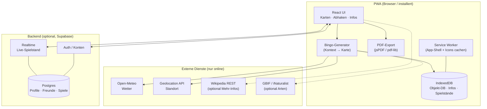

# Konzept & Architektur

Dieses Dokument beschreibt den Ausbau des Waldbingo-PDF-Generators zu einer
**offline-fähigen Progressive Web App (PWA)** mit dynamischen, kontextabhängigen
Bingokarten, optionalen Nutzerkonten, Multiplayer und einer Druckansicht für bis
zu 10 Spieler.

## Vision & Leitprinzipien

Waldbingo wird ein digitaler Begleiter für Familien- und Gruppenausflüge in die
Natur. Beim Start (oder beim Drucken) erzeugt die App eine Bingokarte, deren
Felder zur **aktuellen Situation** passen: Was findet man hier, jetzt, bei diesem
Wetter, zu dieser Jahreszeit?

Vier Leitprinzipien ziehen sich durch alle Entscheidungen:

1. **Offline zuerst.** Im Wald gibt es selten Netz. Kartenerstellung, Abhaken,
   Infotexte und Druck funktionieren vollständig ohne Internet.
2. **Eine Quelle der Wahrheit.** App-Ansicht und Druck-PDF entstehen aus
   demselben Datenmodell und denselben Icons – kein Inhalt wird doppelt gepflegt.
3. **Kindgerecht & sicher.** Große Piktogramme, einfache Sprache, besonders
   strenger Umgang mit Standort- und personenbezogenen Daten von Kindern.
4. **Kuratiert statt zufällig.** Inhalte stammen aus einer geprüften Datenbank
   mit Regeln – nicht aus unvorhersehbaren Live-Generierungen.

## Plattform-Entscheidung: PWA

Gewählt ist eine **Progressive Web App**, weil sie Druck und App aus einer
Codebasis bedient, kostenlos verteilbar ist und voll offline läuft.

| Kriterium | PWA (gewählt) | Native (iOS+Android) |
|---|---|---|
| Eine Codebasis | ✅ ja | ❌ zwei (oder Cross-Framework) |
| Offline-fähig | ✅ Service Worker + IndexedDB | ✅ |
| Installierbar | ✅ „Zum Startbildschirm" | ✅ App Store |
| GPS / Standort | ✅ Geolocation API | ✅ (etwas genauer) |
| PDF erzeugen & drucken | ✅ direkt im Browser | ⚠️ aufwändiger |
| Kosten / Wartung | gering | hoch (Store-Gebühren, Reviews) |

Später lässt sich die PWA bei Bedarf mit Capacitor in eine native Hülle packen,
ohne den Kern neu zu schreiben.

## Tech-Stack

- **Frontend:** React + Vite + TypeScript, PWA-Funktionen über das Vite-PWA-Plugin
  (Workbox). UI mit Tailwind CSS, Karten- und Icon-Darstellung als **SVG**.
- **Lokale Daten / Offline:** IndexedDB über **Dexie.js** für die kuratierte
  Objekt-Datenbank, Infotexte und Spielstände.
- **PDF im Browser:** clientseitig (jsPDF / pdf-lib), läuft auch offline.
- **Backend (optional, nur Multiplayer/Konten):** Supabase (Auth + Postgres +
  Realtime). Einzelspiel und Druck funktionieren ganz ohne Konto und ohne Netz.

## Dynamische Bingo-Generierung

Der Kern-Algorithmus erzeugt aus dem aktuellen **Kontext** eine Karte:

1. **Kontext bestimmen** – Standort → Region/Habitat, Datum → Jahreszeit,
   Wetter-API → Wetterlage, Uhrzeit → Tageszeit, optional Alter/Schwierigkeit.
2. **Pool filtern** – alle Objekte wählen, deren Tags zum Kontext passen.
3. **Gewichten** – besonders typische Funde wahrscheinlicher machen
   (z. B. nach Regen Schnecken/Pilze hochgewichten).
4. **Mischung garantieren** – ausgewogene Verteilung über Kategorien.
5. **Auswählen & anordnen** – 25 Objekte (mit Seed reproduzierbar) ins
   5×5-Raster setzen; mehrere Spieler erhalten denselben Pool in anderer Anordnung.

Details zu den filterbaren Tags stehen im [Datenmodell](./datenmodell.md).

## Architektur im Überblick

## Offline-Konzept

Drei Schichten greifen ineinander:

- **Service Worker (Workbox):** cached App-Shell und alle Piktogramme cache-first;
  Wetter- und sonstige API-Aufrufe laufen network-first mit Cache-Fallback.
- **IndexedDB (Dexie):** speichert die komplette Objekt-Datenbank inkl. Infotexte
  sowie aktive Spiele und Abhak-Status.
- **Background Sync:** Offline-Multiplayer-Aktionen werden in eine Warteschlange
  gelegt und synchronisiert, sobald wieder Netz da ist.

## Datenquellen

- **Wetter – [Open-Meteo](https://open-meteo.com/):** kostenlos, kein API-Key.
- **Standort – [Geolocation API](https://developer.mozilla.org/docs/Web/API/Geolocation_API):**
  Koordinaten mit Nutzererlaubnis, dazu ein manueller Offline-Ortpicker als Fallback.
- **Infotexte:** primär eingebettet in der kuratierten DB (offline), optional online
  über die Wikipedia/Wikimedia REST API angereichert.
- **Regionale Arten (optional):** GBIF bzw. iNaturalist zur saisonalen/regionalen
  Anreicherung des Pools.

## Risiken & offene Punkte

- **Datenschutz (Kinder, DSGVO):** Standort nur grob nutzen und nicht dauerhaft
  speichern; Konten nur für Erwachsene; minimale Datenerhebung; vor Multiplayer
  rechtlich prüfen.
- **Datenpflege:** Qualität der kuratierten DB ist erfolgskritisch (Icons, Tags,
  Infotexte müssen konsistent sein).
- **Supabase Free-Tier:** Realtime-Limits und Pausieren bei Inaktivität beachten.

Die geplanten Ausbaustufen stehen in der [Roadmap](./roadmap.md).
